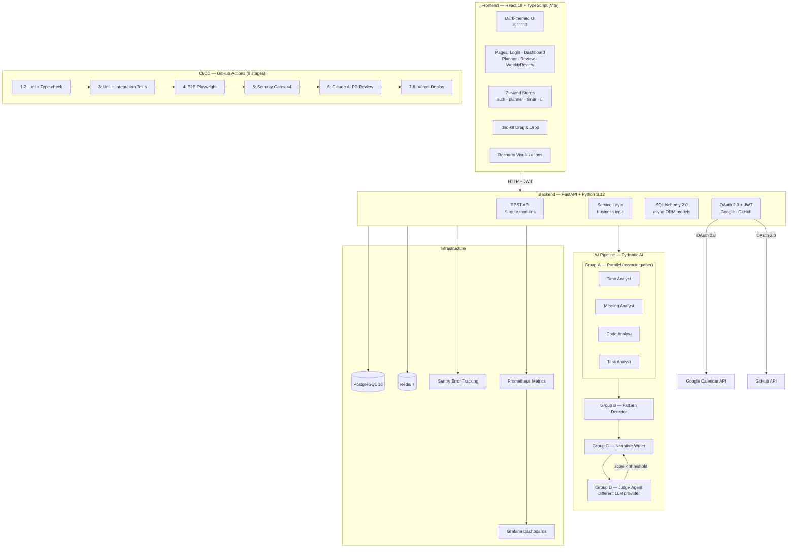
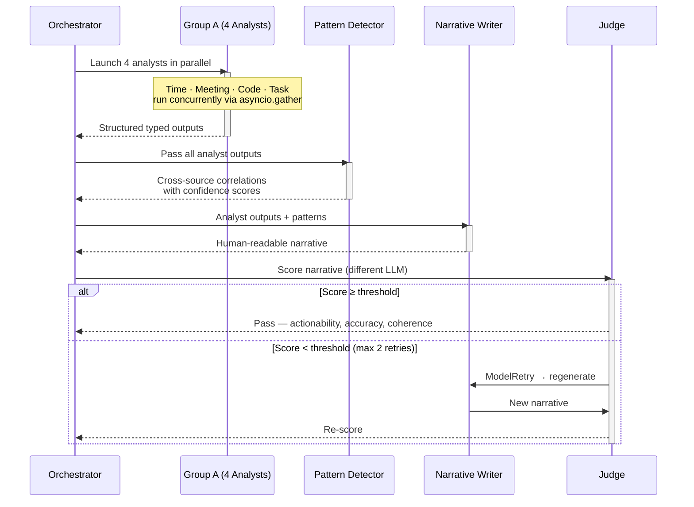
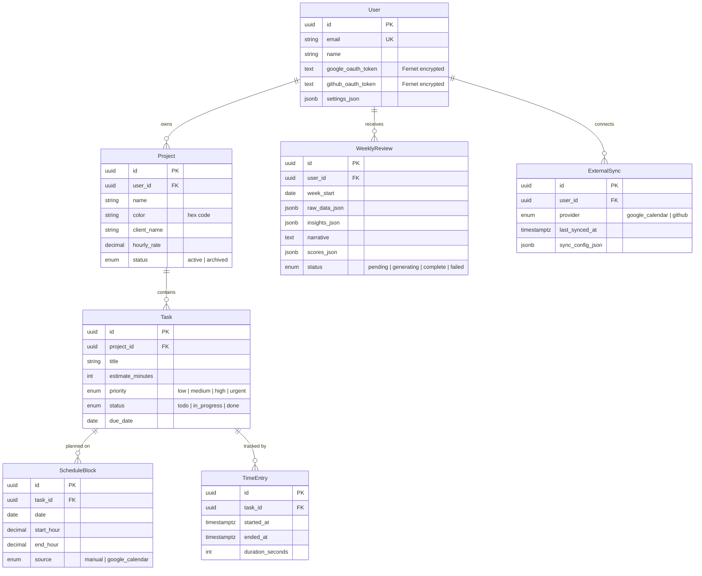

# FlowDay

**AI-powered daily planner for freelancers managing multiple client projects.**

FlowDay bridges the gap between calendar apps (time-only) and task managers (no time awareness). Users organize tasks by project, drag them onto a daily timeline, track time with an inline timer, and receive AI-generated weekly reviews that surface productivity patterns across all their engagements.

---

## Architecture



### AI Weekly Review Pipeline

The core innovation is a multi-agent pipeline that generates weekly productivity reviews:



Each agent uses Pydantic AI with typed `result_type` schemas and `RunContext` dependency injection, keeping agents testable and provider-agnostic.

---

## Tech Stack

| Layer | Technology |
|-------|-----------|
| Frontend | React 18, TypeScript 5, Vite 5, Zustand, React Query, dnd-kit, Recharts |
| Backend | Python 3.12, FastAPI, SQLAlchemy 2.0 (async), Alembic |
| AI | Pydantic AI (provider-agnostic agents with structured outputs) |
| Database | PostgreSQL 16 + asyncpg |
| Cache | Redis 7 |
| Auth | OAuth 2.0 (Google, GitHub) + JWT (access + refresh tokens) |
| Monitoring | Prometheus, Grafana, Sentry |
| CI/CD | GitHub Actions (8 stages), Docker, Vercel |
| Security | OWASP Top 10 compliance, Fernet encryption, 4 security gates |

---

## Data Model



---

## Features

**Project-based task management** — Color-coded projects per client with tasks that have time estimates, priority levels, and due dates.

**Daily planner** — Drag tasks from the project pool onto a time-axis timeline to create schedule blocks.

**Inline timer** — Start/stop time tracking per task; automatically creates TimeEntry records for planned-vs-actual analysis.

**Planned vs Actual view** — Side-by-side daily comparison (planned schedule vs what actually happened) with status tags (done/partial/skipped/unplanned) and weekly bar charts showing estimation accuracy per project.

**Google Calendar integration** — OAuth read-only sync; meetings appear as fixed blocks on the timeline.

**GitHub integration** — OAuth sync of commit activity and PR history for code productivity analysis in weekly reviews.

**AI weekly review** — Multi-agent system generating descriptive and diagnostic insights about your work week.

**LLM-as-Judge evaluation** — A separate model scores each review on actionability, accuracy, and coherence. Low scores trigger automatic regeneration.

---

## Getting Started

### Prerequisites

- Python 3.12 (conda: `conda activate vibing`)
- Node.js 20+
- Docker & Docker Compose
- PostgreSQL 16, Redis 7 (via Docker)

### Setup

```bash
# 1. Clone the repository
git clone https://github.com/<your-org>/FlowDay.git
cd FlowDay

# 2. Start infrastructure
docker compose -f docker/docker-compose.yml up -d    # PostgreSQL + Redis + Prometheus + Grafana

# 3. Backend
cd backend
cp .env.example .env                                  # Configure your secrets
pip install -e ".[dev]"
alembic upgrade head                                  # Apply migrations
uvicorn app.main:app --reload --port 5060

# 4. Frontend (new terminal)
cd frontend
npm install
npm run dev
```

### Access Points

| Service | URL |
|---------|-----|
| Frontend | http://localhost:5173 |
| Backend API | http://localhost:5060 |
| API Docs (Swagger) | http://localhost:5060/docs |
| Grafana | http://localhost:3001 |
| Prometheus | http://localhost:9090 |

---

## CI/CD Pipeline

The GitHub Actions pipeline runs 8 stages on every push and PR:

```
Stage 1-2: Lint + Type-check (backend & frontend, parallel)
    ↓
Stage 3: Unit + Integration Tests (real PostgreSQL, not mocked)
    ↓
Stage 4: E2E Tests (Playwright)
    ↓
Stage 5: Security Gates
    ├── Gate 1: pip-audit (Python CVEs)
    ├── Gate 2: npm audit (Node CVEs)
    ├── Gate 3: Gitleaks (secret detection)
    └── Gate 4: Bandit SAST (Python security)
    ↓
Stage 6: Claude AI PR Review (PRs only)
    ↓
Stage 7: Vercel Preview Deploy (PRs)
Stage 8: Vercel Production Deploy (main)
```

---

## Security

FlowDay implements OWASP Top 10 (2021) mitigations:

- **Auth:** OAuth 2.0 (Google, GitHub) + JWT with short-lived access tokens and refresh rotation
- **Encryption:** OAuth tokens encrypted at rest with Fernet; secrets via environment variables
- **Injection defense:** SQLAlchemy parameterized queries, Pydantic input validation, PII anonymization before LLM calls
- **CI enforcement:** 4 security gates must pass before merge
- **Monitoring:** Sentry error tracking, Grafana dashboards, audit logging for auth events

---

## Monitoring

Custom AI metrics tracked via Prometheus and visualized in Grafana:

| Metric | Description |
|--------|-------------|
| `agent_latency_seconds` | Time spent in each AI agent call |
| `token_cost_total` | Cumulative token cost by agent and model |
| `judge_score` | Judge agent scores (0–100) |
| `http_request_duration_seconds` | API request latency (p50/p95/p99) |

---

## Development Workflow

This project follows a strict 4-phase workflow for every issue:

1. **Explore** — Read existing code, understand impact (no file changes)
2. **Plan** — Write implementation plan with acceptance criteria
3. **Implement** — Strict TDD cycles: RED (failing test) → GREEN (minimum code) → REFACTOR
4. **Commit** — Feature branch with `[#N][RED|GREEN|REFACTOR]` prefix format

All development was done with Claude Code as the AI pair-programming partner, using custom slash commands (`/explore-issue`, `/plan-issue`, `/tdd`) to enforce discipline at each phase.

---

## Project Structure

```
FlowDay/
├── backend/
│   ├── app/
│   │   ├── agents/          # 7 AI agents + orchestrator
│   │   ├── api/             # 9 FastAPI route modules
│   │   ├── core/            # Config, DB, Redis, JWT, metrics
│   │   ├── models/          # SQLAlchemy ORM models
│   │   ├── schemas/         # Pydantic request/response schemas
│   │   └── services/        # Business logic + OAuth sync
│   ├── tests/
│   ├── alembic/             # Database migrations
│   └── Dockerfile
├── frontend/
│   └── src/
│       ├── components/      # TaskCard, TimelineGrid, TimerButton, JudgeScoreCard...
│       ├── pages/           # Login, Dashboard, Planner, Review...
│       ├── stores/          # Zustand state management
│       ├── types/           # TypeScript interfaces
│       └── utils/           # Planner logic, validation, OAuth
├── docker/                  # Docker Compose + Grafana provisioning
├── docs/                    # Architecture docs & implementation plans
└── .github/workflows/       # 8-stage CI/CD pipeline
```

---

## License

This project was built as part of CS 7180 (Special Topics in AI) at Northeastern University, Spring 2026.
